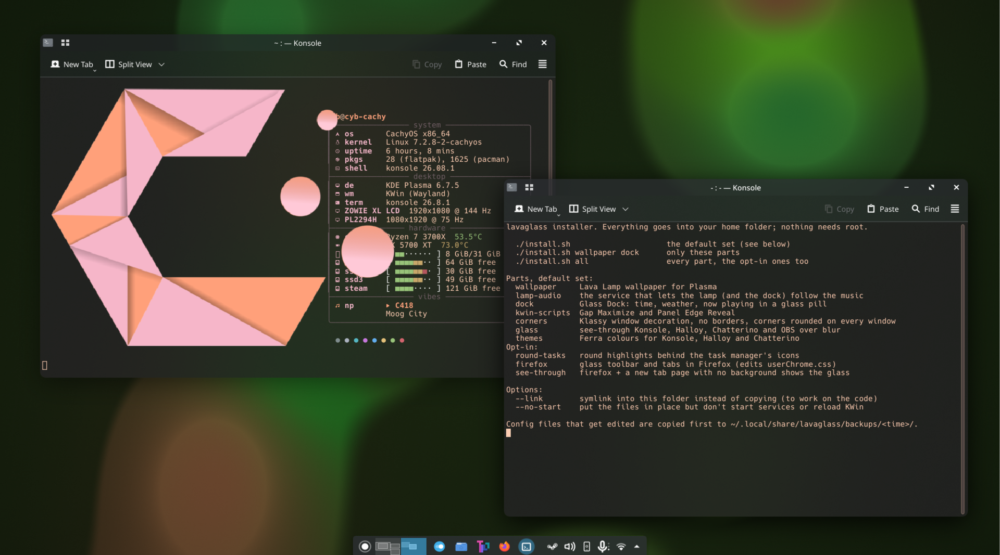
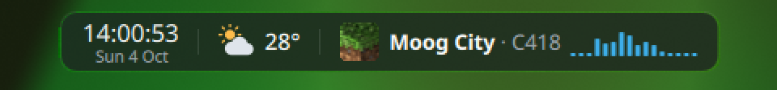

<div align="center">

# lavaglass

**A KDE Plasma 6 desktop in a box: a lava lamp wallpaper that moves to your music, see-through
windows over blur, rounded corners everywhere, and a small glass dock.**<br>
One installer. No root, everything in your home folder, every part optional.

[](#quick-start)
[](#the-fine-print)
[](#quick-start)
[](LICENSE)





</div>

> Vibecoded, and built for one desktop first. [The fine print.](#the-fine-print)

## What you get

- **Lava Lamp**, a Plasma wallpaper: slow wax blobs drifting through dark colour moods, made to
  peek between windows. When music plays it moves to it, the kick most of all, and takes its
  colours from the album cover. On a portrait screen it goes ambient-TV: while a YouTube video
  is on screen, the lamp takes the main colour of the live picture.
- **lamp-audio**, the small service behind that. It follows whatever your desktop's media keys
  would control (a music app, a browser tab), so games and voice chat never move the lamp, and it
  never touches the microphone. YouTube videos count only when they are filed under Music, so
  talk doesn't.
- **Glass Dock**: time, date, weather and now playing in a glass pill at the top of a screen, with
  a little equaliser. Hover for seconds, a calendar and the week's forecast; click the track to
  play or pause. Weather is from [Open-Meteo](https://open-meteo.com), free and without a key.
- **Glass windows**: Konsole, Halloy, Chatterino and OBS at 80% over blur, title bars included.
  Firefox's toolbar and tabs too, if you opt in; pages stay opaque.
- **Rounded corners on every window**, with no borders, so the content itself is rounded and not
  just the frame.
- **Ferra colours**, peach on dark plum, for Konsole, Halloy and Chatterino.
- **Two KWin scripts**: *Gap Maximize* (on a landscape screen, maximize leaves a gap around the
  window, so the lamp shows) and *Panel Edge Reveal* (a short centred auto-hiding panel comes up
  from anywhere on the bottom edge, not only from under itself).

## Quick start

```sh
git clone https://github.com/cybWasHere/lavaglass
cd lavaglass
./install.sh
```

That installs the default set. It tells you at the end what it skipped and what is left for you
to click. Then:

1. **Pick the wallpaper.** Right-click the desktop, *Desktop and Wallpaper*, wallpaper type
   *Lava Lamp*.
2. **Tell the dock where you live.** Put your coordinates in
   `~/.config/lavaglass/glass-dock.json`, then `systemctl --user restart glass-dock`.
3. **Log out and back in once**, so KWin loads the new scripts and effects.

Before it edits a config file of yours, the installer copies it to
`~/.local/share/lavaglass/backups/<time>/`. Running it again is safe. `./uninstall.sh` takes
everything out again.

### Pick your parts

```sh
./install.sh wallpaper lamp-audio     # only these
./install.sh all                      # the opt-in ones too
```

| Part | Does | Needs |
|---|---|---|
| `wallpaper` | Lava Lamp | |
| `lamp-audio` | the lamp and the dock follow the music | `python-numpy`, `python-gobject`, PipeWire |
| `dock` | Glass Dock (built on your machine) | `cmake`, a C++ compiler, Qt 6, KWindowSystem, `layer-shell-qt` |
| `kwin-scripts` | Gap Maximize, Panel Edge Reveal | |
| `corners` | Klassy decoration, no borders, 10 px corners on everything | [Klassy](https://github.com/paulmcauley/klassy), [KDE Rounded Corners](https://github.com/matinlotfali/KDE-Rounded-Corners) |
| `glass` | see-through Konsole, Halloy, Chatterino, OBS | Klassy, [Better Blur DX](https://github.com/xarblu/kwin-effects-better-blur-dx) |
| `themes` | Ferra for Konsole, Halloy, Chatterino | |
| `round-tasks` *(opt-in)* | round highlights behind the task manager's icons | |
| `firefox` *(opt-in)* | glass toolbar and tabs; edits `userChrome.css` | Better Blur DX |
| `see-through` *(opt-in)* | `firefox`, plus a new tab page with no background shows the glass | |

A part whose needs are missing is skipped with a note, and the rest still installs. The three
extras are not installed for you. On Arch and CachyOS they are in the AUR:

```sh
paru -S klassy-bin kwin-effect-rounded-corners-git kwin-effects-better-blur-dx
```

The icon theme that goes with all this is [Tela](https://github.com/vinceliuice/Tela-icon-theme).

## Make it yours

**The lamp.** Its settings (same dialog as the wallpaper type) have the palette, or a slow drift
through all of them, speed, brightness, frame rate, and whether it pauses under a maximized
window. *Two waxes merging make a new colour* is off by default and rather wild; try it with
something loud.

**What counts as music.** Add a drop-in with `systemctl --user edit lamp-audio`:

```ini
[Service]
Environment=LAMP_AUDIO_IGNORE="twitch.tv"     # never follow these (page address or title)
Environment=LAMP_AUDIO_MUSIC="lofi mix"       # YouTube videos to count as music anyway
```

`~/.local/share/lavaglass/lamp-audio/lamp-audio.py --watch` prints what a lamp would get.

**The dock.** `~/.config/lavaglass/glass-dock.json` holds `lat` and `lon`, and `screen`: a word
from the model name of the monitor it should sit on, empty for the first one.

**The gap.** Gap Maximize uses KWin's own tile padding. Press Meta+T on the landscape screen,
keep one full-screen tile, and set its padding: that is the gap.

**Glass in Firefox.** The tint matches Breeze Dark. For another theme, change `--glass-tint` in
the marked block of your profile's `chrome/userChrome.css`.

**See-through new tab.** With `see-through`, a new tab page that paints no background shows the
blurred desktop. It pairs with the See-through mode of
[startpage](https://github.com/cybWasHere/startpage), which has the same lava lamp.

## Good to know

- **Wayland only.** The dock is a layer-shell window and the lamp watches windows through
  Plasma's own screencast route.
- **Video colour needs the video on screen.** It reads the real picture of the Firefox
  Picture-in-Picture window, or of the browser window showing the video, and only on a portrait
  screen. Nothing is recorded or sent anywhere.
- **lamp-audio talks to one outside server**: youtube.com, once per video, to read its category.
  Everything else stays on loopback (`127.0.0.1:9873`).
- **Blur is all or nothing.** The `glass` part switches KWin's stock blur for Better Blur DX,
  because the stock one can't blur apps that don't ask for it.
- **See-through has a cost.** With that Firefox pref on, pages with no background of their own
  are drawn on the dark tab backdrop instead of white.
- **Working on the code.** `./install.sh --link` symlinks into the clone instead of copying.
  After editing `wallpaper/contents/shaders/lava.frag`, rebuild it with
  `/usr/lib/qt6/bin/qsb --qt6 -o lava.frag.qsb lava.frag`.

## Troubleshooting

- **Blur is gone everywhere after an update.** Better Blur DX is compiled against KWin; rebuild
  it (`paru -S --rebuild kwin-effects-better-blur-dx`).
- **Konsole's toolbar stays opaque.** It needs the Klassy widget style, which the installer sets
  for Konsole only; restart Konsole.
- **Corners are round on the frame but square inside.** Window borders are on. The `corners` part
  turns them off; check *Window Decorations* in System Settings.
- **The lamp doesn't move.** `systemctl --user status lamp-audio`, then the `--watch` command
  above while something plays.
- **No dock.** `journalctl --user -u glass-dock -e`. If the build was skipped, the installer said
  which package was missing.

## The fine print

**Vibecoded.** The code and these docs were written by Claude, an AI coding agent, directed by the
repo owner, who runs all of it every day on one machine: CachyOS, Plasma 6.7 on Wayland, two
monitors. The installer and uninstaller were tested against throwaway home folders, empty and
full, not on a second real desktop, and there is no CI. It edits `kwinrc`, `kwinrulesrc`, Klassy's
config and, if asked, your Firefox profile. It backs each one up first, but read `install.sh`
before you trust it; it's short.

**Thanks** to [Halloy](https://halloy.chat) for the Ferra palette, to
[Klassy](https://github.com/paulmcauley/klassy),
[KDE Rounded Corners](https://github.com/matinlotfali/KDE-Rounded-Corners) and
[Better Blur DX](https://github.com/xarblu/kwin-effects-better-blur-dx) for doing the hard parts,
and to [Open-Meteo](https://open-meteo.com) for free weather without keys.

**License.** MIT, see [LICENSE](LICENSE).
